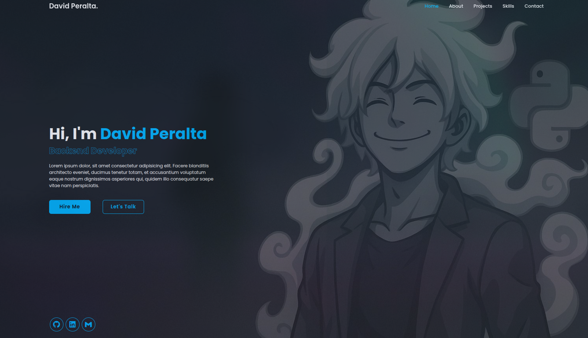

# 💼 Personal Portfolio – David Peralta

This is my personal web portfolio, developed from scratch with HTML, CSS, and JavaScript.
Its purpose is to showcase my projects, experience, and skills as a backend developer in a clean, modular, and scalable way.

---

## 🌐 Live Demo

👉 [https://david-peralta-rd.github.io/David-Portfolio/] *(PortFolio)

---

## 🚀 Technologies Used

- Semantic HTML5
- CSS3 with Modular Organization
- Pure JavaScript (ES6)
- Responsive Design without Frameworks
- Component-Based Organization

---

## 📁 General Structure
src/

├── modules/ # Modular JS for experience and projects

├── config/media/ # Images, backgrounds, and visual assets

├── view/css/ # Styles divided by component
index.html # Home Page

---

## 📄 License and Use

This portfolio is open source under the MIT license.

### ✅ You may:
- Use the structure, code, and logic as the basis for your own portfolio.
- Freely modify the files to suit your profile.

### 🚫 You may not:
- Use my personal images, name, data, or generated avatar as if they were your own.
- Upload this project without modifying the visual identity, text, or personal information.
- Clone the entire site without attribution and publish it as your own.

Out of respect for the work and identity of the person who created it, **you must modify the content and fully customize it before using it publicly**.

---

## 📫 Contact

If you have questions or want to connect professionally:

- GitHub: [https://github.com/David-Peralta-Rd]
- LinkedIn: [https://www.linkedin.com/in/david-peralta-380652366/]
